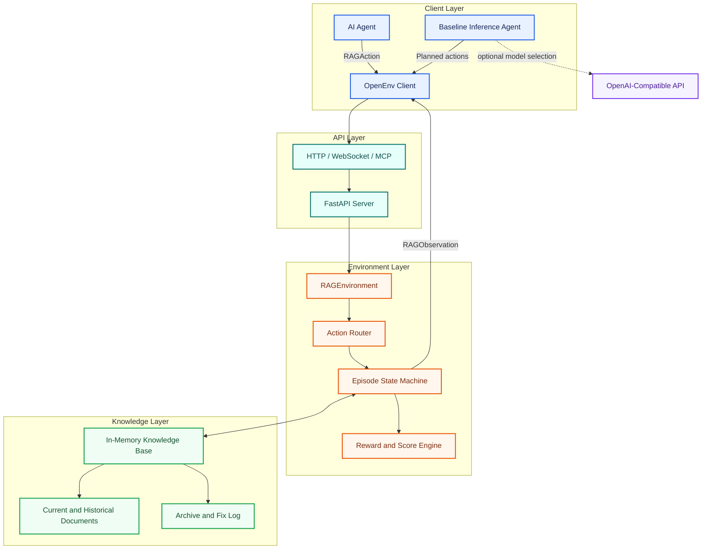

# Self-Healing RAG Environment

[](https://www.python.org/)
[](https://fastapi.tiangolo.com/)
[](https://www.docker.com/)
[](https://github.com/meta-pytorch/OpenEnv)

An OpenEnv benchmark for evaluating AI agents that detect and repair
hallucinations caused by stale internal documents.

The environment simulates a changing enterprise knowledge base. An agent must
ground its answer in retrieved evidence, recognize conflicts between document
versions, identify the exact outdated source, archive it, and verify the
corrected answer.

This project demonstrates:

- Stateful agent-environment interaction through typed actions and observations.
- Hidden ground-truth labels to prevent shortcut solutions.
- Randomized document IDs on every episode.
- Multi-step reward scoring and task-specific evaluation.
- A FastAPI server with OpenEnv WebSocket and MCP support.
- A deterministic baseline agent with optional OpenAI-compatible model guidance.

## Problem

Retrieval-augmented generation systems can produce incorrect answers when old
documents remain alongside newer policy revisions. The agent must do more than
answer a question: it must diagnose the evidence problem and repair the source
of the hallucination.

The knowledge base contains synthetic enterprise policies covering leave,
pricing, refunds, travel, support SLAs, and remote work. Each scenario includes
multiple historical revisions and one current revision.

## How It Works

```text
Reset task
  |
  v
Retrieve public document fields
  |
  v
Agent submits typed action
  |
  +--> answer       Ground the initial response
  +--> detect       Identify conflicting or stale evidence
  +--> find_source  Name the exact outdated document
  +--> fix          Archive the outdated document
  +--> verify       Confirm the current answer
  |
  v
Environment returns observation, reward, and completion state
```

Ground-truth fields such as `is_outdated` and `correct_doc_id` remain inside
the server. The agent only receives public document fields: ID, title, content,
date, and topic.

## System Architecture



The request path is intentionally simple: the agent submits a typed action,
the environment updates its private state and knowledge base, and the client
receives a typed observation with the next reward.

### Component Responsibilities

| Component | Responsibility |
| --- | --- |
| AI agent | Reads public evidence and submits the next action. |
| OpenEnv client | Converts typed Python models into environment requests. |
| FastAPI server | Exposes HTTP, WebSocket, MCP, task, and grading interfaces. |
| `RAGEnvironment` | Controls the episode lifecycle and action order. |
| Internal database | Stores document versions and archives outdated records. |
| State machine | Tracks answers, detection, source identification, fixes, and verification. |
| Reward engine | Scores correctness, repair progress, and action efficiency. |
| Baseline inference agent | Builds a plan and optionally uses a language model to choose actions. |

## Task Suite

| Task | Difficulty | Goal | Passing Score |
| --- | --- | --- | --- |
| `task_detect_hallucination` | Easy | Detect stale conflicting evidence | `0.60` |
| `task_find_source` | Medium | Identify the exact outdated source | `0.70` |
| `task_full_pipeline` | Hard | Answer, detect, find, fix, and verify | `0.85` |
| `task_cross_topic_audit` | Expert | Audit several topics and archive every stale document | `0.90` |

Episodes are limited by a maximum step count. Scores reward correct reasoning,
successful repairs, verification, and efficient action sequences.

## Tech Stack

- Python 3.10+
- FastAPI and Uvicorn
- Pydantic models
- OpenEnv Core
- OpenAI-compatible Python client
- Docker

## Quick Start

### 1. Install dependencies

```bash
python -m venv .venv
```

Activate the environment:

```bash
# macOS/Linux
source .venv/bin/activate

# Windows PowerShell
.venv\Scripts\Activate.ps1
```

Install the server dependencies:

```bash
python -m pip install -r server/requirements.txt
```

### 2. Start the server

```bash
uvicorn server.app:app --host 0.0.0.0 --port 7860
```

The service is available at `http://localhost:7860`.

Useful endpoints:

| Endpoint | Purpose |
| --- | --- |
| `/` | Service metadata and available links |
| `/health` | Health check provided by OpenEnv |
| `/docs` | Interactive FastAPI documentation |
| `/tasks` | Task definitions and action/observation schemas |
| `/grader` | Evaluate a submitted trajectory |
| `/ws` | OpenEnv WebSocket interface |
| `/mcp` | OpenEnv MCP interface |

### 3. Run a client episode

```python
from rag_env import RAGAction, RAGEnv

with RAGEnv(base_url="http://localhost:7860").sync() as env:
    result = env.reset(task_name="task_full_pipeline")
    print(result.observation.question)

    result = env.step(
        RAGAction(
            action_type="answer",
            content="20 days",
        )
    )
    print(result.observation.message)
```

## Action and Observation Models

Every action contains an action type, explanatory content, and an optional
document ID:

```python
RAGAction(
    action_type="fix",
    content="Archive the outdated policy revision.",
    target_doc_id="leave_policy_1_a1b2c3",
)
```

The environment returns a typed observation containing the question, retrieved
documents, current answer, repair state, reward, and completion state.

```python
RAGObservation(
    question="...",
    retrieved_documents=[...],
    current_answer="20 days",
    hallucination_detected=True,
    conflicting_docs=[...],
    database_fixed=True,
    step_number=4,
    message="...",
    reward=0.99,
    done=True,
)
```

## Baseline Agent

[inference.py](inference.py) provides a baseline solver that:

1. Extracts answer-bearing values from retrieved documents.
2. Compares document revisions by topic and date.
3. Builds a task-specific action plan.
4. Uses an OpenAI-compatible model to select among candidate actions.
5. Detects conflicts, archives stale sources, and verifies the latest answer.

Configure the model with environment variables:

```bash
# macOS/Linux
export HF_TOKEN=your_token
export API_BASE_URL=https://api.openai.com/v1
export MODEL_NAME=gpt-4.1-mini

# Windows PowerShell
$env:HF_TOKEN = "your_token"
$env:API_BASE_URL = "https://api.openai.com/v1"
$env:MODEL_NAME = "gpt-4.1-mini"
```

Run it with:

```bash
python inference.py
```

The runner emits `[START]`, `[STEP]`, and `[END]` records for evaluation
systems.

## Validation

Compile the Python source:

```bash
python -m compileall -q .
```

Validate the OpenEnv configuration:

```bash
openenv validate
```

## Docker

Build and run the server image:

```bash
docker build -f server/Dockerfile -t self-healing-rag .
docker run --rm -p 7860:7860 self-healing-rag
```

The environment stores its synthetic knowledge base in memory. Resetting an
episode creates a fresh task instance; no external database is required.

## Project Structure

```text
.
├── client.py                 # Typed OpenEnv HTTP client
├── inference.py              # Baseline agent and action planner
├── models.py                 # Pydantic action, observation, and state models
├── tasks.py                  # Scenario bank and task instance generation
├── openenv.yaml              # OpenEnv metadata and deployment configuration
├── pyproject.toml            # Python package metadata
├── rag_env/                  # Public package exports
└── server/
    ├── app.py                # FastAPI application and HTTP endpoints
    ├── environment.py        # Environment state machine and scoring logic
    ├── requirements.txt      # Runtime dependencies
    └── Dockerfile            # Server container image
```

## Project Goal

This project explores how an agent can detect unsupported answers, reason over
conflicting retrieved evidence, make a targeted knowledge-base repair, and
verify that the repaired system produces a current answer.
